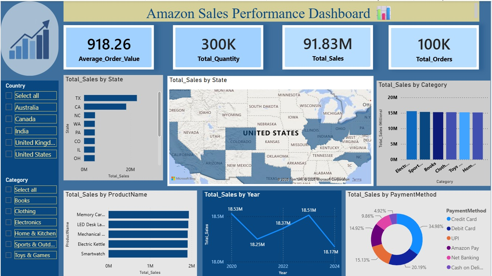

# 📊 Amazon Sales Data Analysis Dashboard

## 📌 Project Overview

This project analyzes Amazon sales data using **Power BI** to identify sales trends, customer behavior, product performance, and key business insights.

The goal of this project is to transform raw sales data into an interactive dashboard that can help understand business performance and support data-driven decision-making.

## 🛠️ Tools & Technologies

* **Power BI** – Data visualization and dashboard creation
* **Power Query** – Data cleaning and transformation
* **DAX** – Measures and calculations
* **Excel / CSV** – Data source
* **GitHub** – Project documentation and portfolio

## 📂 Dataset

The project uses an Amazon sales dataset containing information related to:

* Customer details
* Product categories
* Product names
* Order information
* Quantity
* Sales/revenue
* Other sales-related attributes

## 🔄 Project Workflow

**Raw Data → Data Cleaning → Data Transformation → Data Analysis → Dashboard → Business Insights**

### 1. Data Cleaning

* Checked for missing values
* Checked for errors and inconsistent data
* Standardized text values
* Removed unnecessary inconsistencies
* Prepared the dataset for analysis

### 2. Data Analysis

Created calculations and measures to analyze:

* Total Sales / Revenue
* Average Order Value
* Average Quantity per Order
* Product performance
* Category performance
* Customer-related metrics

### 3. Dashboard

The Power BI dashboard provides an interactive view of Amazon sales performance using charts, cards, filters, and slicers.

### 📸 Dashboard Preview

## 📈 Key Analysis Areas

* Sales performance
* Product performance
* Category-wise sales
* Customer analysis
* Order quantity analysis
* Revenue trends

## 💡 Business Insights

The dashboard can be used to identify:

* High-performing products
* High-performing categories
* Sales patterns
* Customer purchasing behavior
* Areas requiring further investigation

## 🎯 Project Objective

This project demonstrates my ability to work with data, perform basic data cleaning and analysis, create meaningful visualizations, and communicate insights through an interactive Power BI dashboard.

## 👩‍💻 About Me

I am a **Civil Engineering graduate transitioning into Data Analytics**, currently developing my skills in **Python, SQL, Power BI, and data analysis**.

I am interested in entry-level opportunities where I can apply my analytical and problem-solving skills while continuing to learn and grow as a Data Analyst.

---

⭐ If you found this project useful, feel free to explore the repository.
